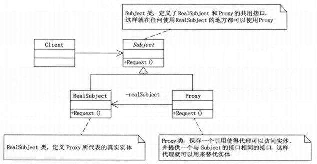

# Design_Patterns_hezl

### 代理模式

**代理模式（proxy）**，为其他对象提供一种代理以控制对这个对象的访问。

代理模式给某一个对象提供一个代理，并由代理对象控制对原对象的引用。

**Subject类**，定义了RealSubject和Proxy的共用接口，这样就在任何使用RealSubject的地方都可以使用Proxy。

**RealSubject类**，定义Proxy所代表的真实实体。

**Proxy类**，保存一个引用使得代理可以访问实体，并提供一个与Subject的接口相同的接口，这样代理就可以用来替代实体。

