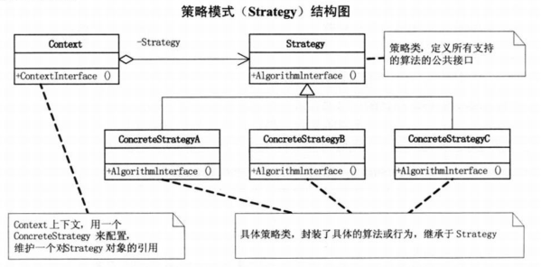
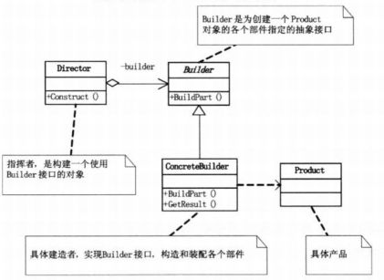

# Design_Patterns_hezl

### 策略模式

策略模式定义了算法家族，分别封装起来，让他们之间可以相互替换，此模式让算法的变化，不会影响到使用算法的客户。

### 代理模式

**代理模式（proxy）**，为其他对象提供一种代理以控制对这个对象的访问。

代理模式给某一个对象提供一个代理，并由代理对象控制对原对象的引用。

**Subject类**，定义了RealSubject和Proxy的共用接口，这样就在任何使用RealSubject的地方都可以使用Proxy。

**RealSubject类**，定义Proxy所代表的真实实体。

**Proxy类**，保存一个引用使得代理可以访问实体，并提供一个与Subject的接口相同的接口，这样代理就可以用来替代实体。

### 建造者模式

建造者模式（Builder），将一个复杂对象的构建与它的表示分离，使得同样的构建过程可以创建不同的表示。

**Builder**：创建一个Product对象的各个部件指定的抽象接口

**ConcreteBuilder**：具体的建造者，实现Builder的接口，构造和装配各个部件。

**Director**：构建一个使用Builder接口的对象。

使用场景：主要用于创建一些复杂的对象，这些对象内部构建间的建造顺序通常是稳定的，但对象内部的构建通常面临着复杂的变化。

建造者模式的好处就是使得建造代码和表示代码分离，由于建造者隐藏了该产品是如何组装的，所以若需要改变一个产品的内部表示，只需要再定义一个具体的建造者就可以了。

优点：

1. 隔离了构建的步骤和具体的实现，为产品的具体实现提供了灵活度。
2. 封装和抽象了每个步骤的实现，实现了依赖倒转原则。
3. 封装了具体的步骤，减少了代码的冗余。

缺点：

​	要求构建产品的步骤（算法）是不能剧烈变化的，最好是不变的，这样就影响了灵活度。

